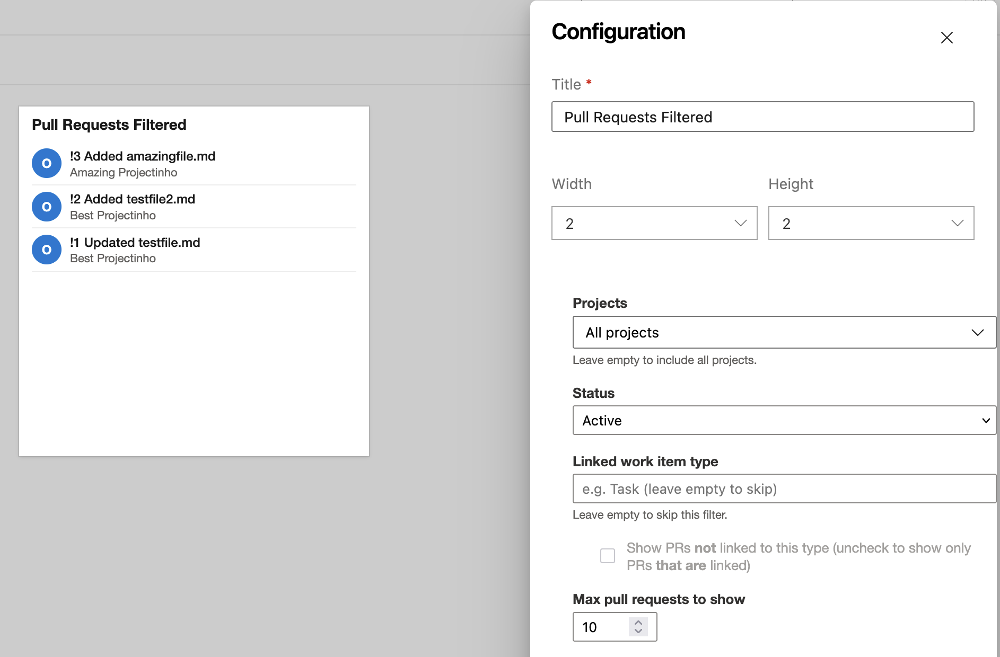

# Pull Requests Filtered

A lightweight Azure DevOps **dashboard widget** that shows a live, filtered list of pull requests directly on any project dashboard. Pin multiple tiles — each with its own independent filter configuration — to keep the PRs that matter to you always in view.

---

## Features

### Flexible filtering
Configure each widget tile independently:

- **Projects** — choose any subset of projects within your organisation, or leave the list empty to include all projects
- **Status** — filter by Active, Draft, Approved, Approved with suggestions, Awaiting Approval, Awaiting Author, Rejected, Abandoned, Completed, or All
- **Max count** — display 1 to 50 pull requests per tile

### Linked work item type filter
Enter a linked work item type name (e.g. `Task`) to filter pull requests by their traceability links:

- **Checkbox checked** — show only PRs that are **not** linked to a work item of that type (useful for surfacing code reviews missing a required planning link)
- **Checkbox unchecked** — show only PRs that **are** linked to a work item of that type
- **Field left empty** — no work item type filtering is applied

### Live configuration preview
The configuration panel updates the widget tile in real time as you adjust settings, before you save.

### Configurable tile name and size
Rename the tile to anything meaningful (e.g. "My team's open PRs" or "Unlinked PRs — main") and choose from four supported tile sizes:

| Size | Grid units |
|---|---|
| Small | 2 × 2 |
| Wide | 3 × 2 |
| Tall | 2 × 3 |
| Large | 3 × 3 |

---

## Getting started

1. Install the extension from the Marketplace
2. Go to any project dashboard (**Overview → Dashboards**)
3. Click **Edit → Add a widget**
4. Search for **Pull Requests Filtered** and click **Add**
5. Click the gear icon on the tile to configure your filters
6. Click **Save**

---

## Permissions

This extension requires the following scopes:

| Scope | Purpose |
|---|---|
| `vso.code` | Read pull requests and repository information |
| `vso.identitypicker` | Resolve user identities for creator/reviewer filters |
| `vso.project` | Enumerate projects for the cross-project project picker |
| `vso.work` | Read work item types when checking PR traceability links |

---

## Support

- [Report an issue](https://github.com/ommhoa/Pull-Requests-Filtered/issues)

---

## Privacy

This extension does not collect, store, or transmit any personal data outside of your Azure DevOps organization. All API calls are made directly from your browser to your own Azure DevOps instance.
